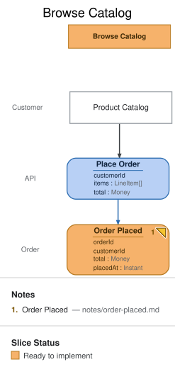

# Slice: Browse Catalog

## Intent

A shopper has picked items from the product catalog and wants to commit to buying them.
This is the entry point of the whole fulfillment story — every later slice (payment,
receipt) exists because this one happened first. Originating ticket: MIL-60.

## Trigger & Actor

A `Customer`, acting on the **Product Catalog** screen.

## Command / Input

**Command:** `Place Order`

| Field | Type | Required | Rules / Validation |
|-------|------|----------|--------------------|
| customerId | UUID | yes | Must resolve to an active, non-suspended customer account. |
| items | `LineItem[]` | yes | At least one line item; each item's `productId` must exist and be in stock at command time (stock is re-checked, not just at add-to-cart time). |
| total | Money | yes | Must equal the sum of `items[].unitPrice * quantity` — the server recomputes and rejects a mismatched client-supplied total rather than trusting it. |

## Trigger

**Triggered by:** screen `Product Catalog` @Customer

## Event(s) Emitted

**Event:** `Order Placed` → context `Order`
**Read by:** `Open Orders`, in the **View Open Orders** slice.

| Field | Type | Immutable Fact? | Source / Notes |
|-------|------|-----------------|----------------|
| orderId | UUID | yes | Server-generated at decision time — never supplied by the command (this is why `em validate` flags it as a field-completeness warning; it's the documented "system supplies this" case, not a gap). |
| customerId | UUID | yes | Copied from the command. |
| total | Money | yes | Copied from the command (already server-validated above). |
| placedAt | Instant | yes | Server clock at decision time — same system-generated shape as `orderId`. |

## Invariants / Business Rules

- **INV-BC-1:** An order's `total` must equal the sum of its line items' `unitPrice * quantity`
  at order time.
  - Violation ⇒ rejection, no event.
- **INV-BC-2:** Every line item's product must be in stock at the moment `Place Order` is
  handled (checked then, not reserved earlier).
  - A race against another shopper's concurrent order is a legitimate rejection, not a bug.
  - An order that fails this check is rejected outright; it never emits `Order Placed`, and
    there is no separate "rejected" event for it.
- **INV-BC-3:** `Place Order` is not idempotent.
  - Each accepted call records a new order, even with identical content to a prior call —
    de-duplicating a doubled submit is the client's job (disable the button on submit), not
    this command's.

## Scenarios (Given / When / Then)

- **Happy path**
  - **Given:** an active customer and a cart of in-stock items whose prices sum to the
    declared total
  - **When:** `Place Order` is issued
  - **Then:** `Order Placed` is recorded and the order becomes visible in **Open Orders**.
- **Rejected (INV-BC-1)**
  - **Given:** a cart whose declared `total` doesn't match the sum of its line items
  - **When:** `Place Order` is issued
  - **Then:** rejected with a total-mismatch error; no event.
- **Rejected (INV-BC-2)**
  - **Given:** a line item that just sold out
  - **When:** `Place Order` is issued
  - **Then:** rejected with an out-of-stock error naming the item; no event.

## Alternate & Error Flows

- Idempotency: the catalog UI may retry a failed submit. `Place Order` is not itself
  idempotent on repeat calls with identical content — that's the open question below.

## Non-Functional Requirements

- **Security / authz:** the customer must be authenticated; `customerId` is taken from the
  session, never from client input, even though the field table above shows it as part of
  the command shape.
- **PII & compliance:** none beyond the customer's own account linkage — no payment data
  is captured in this slice.
- **Performance / SLA:** none.

## Dependencies & Read Models Affected

- **Upstream events this slice relies on:** none — this is the first slice in the story.
- **Downstream read models / slices affected:** **View Open Orders** (projects `Order Placed`).

## Open Questions

- [x] Should a placed order reserve stock immediately, or only on payment capture? — resolved: neither reserves it; INV-BC-2 checks stock at order time and lets a later concurrent order legitimately win the race. — source: notes/order-placed.md
- [x] Does an order placed with an out-of-stock item still emit this event, or a separate `Order Rejected`? — resolved: it's rejected outright (INV-BC-2); no event of any kind. — source: notes/order-placed.md
- [x] Is a retried `Place Order` with identical content idempotent, or does every submit record a new order? — resolved: not idempotent (INV-BC-3); de-duplication is a client concern.
