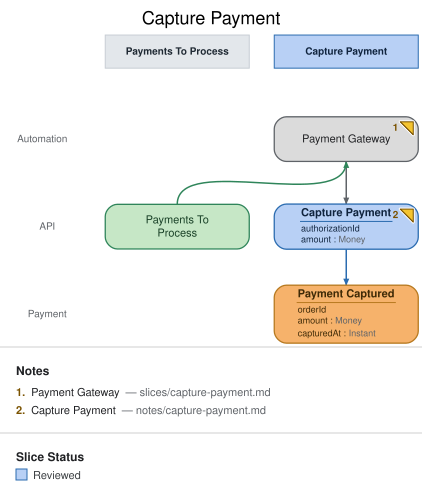

# Slice: Capture Payment

## Intent

Once a payment has been requested (checkout), the system itself — not a person — should go
capture it from the payment gateway. This is the model's one Automation: nobody sits at a
screen watching for pending payments and clicking a button; the reaction fires on its own
against the **Payments To Process** read model.

## Trigger & Actor

**Internally triggered**: the `Payment Gateway` processor watches the **Payments To
Process** read model (populated in the slice before this one) and reacts whenever a new
entry appears there. It triggers the `Capture Payment` command — reactions never record an
event directly (see `patterns.md`).

## Command / Input

**Command:** `Capture Payment`

| Field | Type | Required | Rules / Validation |
|-------|------|----------|--------------------|
| authorizationId | (untyped) | yes | Must reference a payment authorization the gateway itself returned when `Payment Requested` was raised — the processor supplies this, a human never does. |
| amount | Money | yes | Must equal the authorized amount; see the "partial captures" open question below. |

## Trigger

**Triggered by:** processor `Payment Gateway`, also in this slice.

## Event(s) Emitted

**Event:** `Payment Captured` → context `Payment`
**Read by:** `Pending Payments`… — **not actually true yet, see Open Questions.**

| Field | Type | Immutable Fact? | Source / Notes |
|-------|------|-----------------|----------------|
| orderId | UUID | yes | Not provided by `Capture Payment`'s own field list above — `em validate` correctly flags this as a field-completeness warning. It's a real gap: the command's `authorizationId` needs to resolve back to an `orderId` somewhere (the gateway's own records, or a lookup the processor performs before issuing the command), and that resolution isn't modeled explicitly yet. |
| amount | Money | yes | Copied from the command. |
| capturedAt | Instant | yes | Server clock at capture time — system-generated, same shape as `Order Placed.placedAt`. |

## Invariants / Business Rules

- **INV-CAP-1 (idempotency):** capturing twice for the same `authorizationId` is a defect, not a
  legitimate retry.
  - The command handler must dedupe on it. The gateway is known to retry.
- **INV-CAP-2:** a declined capture must not silently disappear.
  - See Open Questions; this model doesn't yet have a failure event for it.

## Scenarios (Given / When / Then)

- **Happy path**
  - **Given:** an entry in **Payments To Process**
  - **When:** the `Payment Gateway` processor picks it up
  - **Then:** `Capture Payment` is issued and `Payment Captured` is recorded.
- **Rejected (INV-CAP-1)**
  - **Given:** `Capture Payment` has already succeeded once for an `authorizationId`
  - **When:** the gateway retries with the same id
  - **Then:** the second call is a no-op (already-captured), not a second `Payment Captured`.

## Alternate & Error Flows

- Gateway retries: covered by INV-CAP-1.
- Declined capture: currently unmodeled — see Open Questions. This is the kind of gap the
  `conform` phase is meant to catch once real payment-gateway code exists and this slice
  doc is checked against it.

## Non-Functional Requirements

- **Security / authz:** none beyond service-to-service auth between this system and the
  payment gateway, which isn't modeled at the event level.
- **PII & compliance:** the model deliberately never carries card data — only an opaque
  `authorizationId` the gateway itself manages.
- **Performance / SLA:** none specified.

## Dependencies & Read Models Affected

- **Upstream events this slice relies on:** `Payment Requested` (**Checkout**), via the
  **Payments To Process** view.
- **Downstream read models / slices affected:** **Show Receipt** projects `Payment
  Captured`. **Manager Review**'s `Pending Payments` view is fed by `Payment Requested`
  directly, not by this slice's output — see the open question below, this was nearly a
  point of confusion while modeling.

## Open Questions

- [ ] What resolves `authorizationId` → `orderId` for the `Payment Captured` event's
  `orderId` field? Not modeled yet — the field-completeness warning on this event is real.
- [ ] What happens on a declined capture? Today it has no event and no visible outcome
  anywhere in the model — needs either a `Payment Capture Failed` event or an explicit
  decision that declines are handled entirely outside this system.
- [ ] Partial captures (e.g. after a line-item cancellation reduces the authorized amount) —
  supported, or does `Capture Payment` always capture in full?
