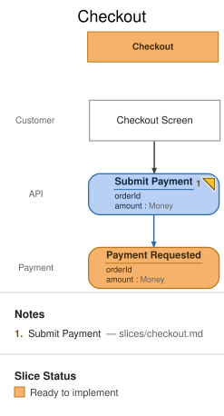

# Slice: Checkout

## Intent

Once a customer has decided to buy what's in their open order, they need to actually pay
for it. This slice is deliberately small — it only records that payment was *requested*;
the automatic capture is a separate concern, handled by the **Capture Payment** slice.

## Trigger & Actor

A `Customer`, acting on the **Checkout Screen**.

## Command / Input

**Command:** `Submit Payment`

| Field | Type | Required | Rules / Validation |
|-------|------|----------|--------------------|
| orderId | UUID | yes | Must reference an order that exists and hasn't already had a payment requested for it (INV-CHK-1). |
| amount | Money | yes | Must equal that order's `total` — this command doesn't accept partial payment. |

## Trigger

**Triggered by:** screen `Checkout Screen` @Customer

## Event(s) Emitted

**Event:** `Payment Requested` → context `Payment`
**Read by:** `Pending Payments` (**Manager Review**) and `Payments To Process` (**Payments
To Process**) — two different read models over the same event, one for a human to watch,
one for the automation to act on.

| Field | Type | Immutable Fact? | Source / Notes |
|-------|------|-----------------|----------------|
| orderId | UUID | yes | Copied straight from the command. |
| amount | Money | yes | Copied straight from the command. |

Unlike **Browse Catalog**'s `Order Placed` or **Capture Payment**'s `Payment Captured`,
every field this event carries is also on the command that triggers it — there's no
system-generated data here (no server-minted id, no server clock timestamp), so
`em validate` has nothing to warn about on either side. That's not a coincidence worth
glossing over: it's what a field-completeness pair with nothing left to explain actually
looks like.

## Invariants / Business Rules

- **INV-CHK-1:** An order may have at most one `Payment Requested` outstanding at a time.
  - Submitting payment twice for the same order before it's captured is rejected, not
    recorded as a second request.

## Scenarios (Given / When / Then)

- **Happy path**
  - **Given:** an order with no outstanding payment request
  - **When:** `Submit Payment` is issued for its full total
  - **Then:** `Payment Requested` is recorded and the payment becomes visible to both
    **Manager Review** and the **Capture Payment** automation.
- **Rejected (INV-CHK-1)**
  - **Given:** an order that already has a `Payment Requested` outstanding
  - **When:** `Submit Payment` is issued for it again
  - **Then:** rejected; no second event.
- **Rejected (amount mismatch)**
  - **Given:** a `Submit Payment` amount that doesn't match the order's total
  - **When:** it's issued
  - **Then:** rejected with an amount-mismatch error; no event.

## Alternate & Error Flows

- Idempotency: covered by INV-CHK-1 — a resubmit while a request is outstanding is rejected
  outright rather than silently deduplicated, so the customer sees the state clearly instead
  of wondering if their second click did anything.

## Non-Functional Requirements

- **Security / authz:** the customer must be authenticated and own the order being paid for.
- **PII & compliance:** no card data — this slice only records the *intent* to pay an
  amount; actual payment details are the gateway's concern, outside this model.
- **Performance / SLA:** none specified.

## Dependencies & Read Models Affected

- **Upstream events this slice relies on:** none directly — reads the order only by
  reference (`orderId`), not by requiring `Order Placed` to have projected anywhere first.
- **Downstream read models / slices affected:** **Manager Review**'s `Pending Payments`, and
  **Payments To Process** (which the **Capture Payment** automation watches).

## Open Questions

None — nothing about this slice surfaced an unresolved question while modeling it.
