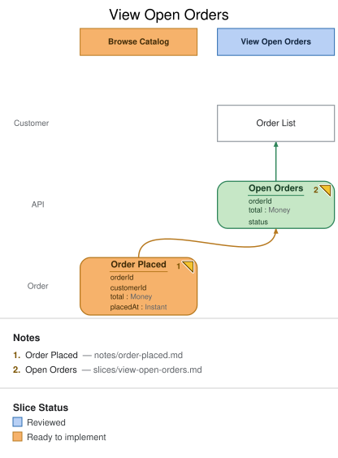

# Slice: View Open Orders

## Intent

Once a customer has placed an order, they need somewhere to see it — this is that screen.
It's the read side of the **Browse Catalog** slice's write: the model calls out explicitly
that every command's event must be read by some view, and this is the view that reads
`Order Placed`.

## Trigger & Actor

Not applicable — this is a pure read path. It's populated by `Order Placed` and displayed
whenever a `Customer` opens the **Order List** screen; nothing "triggers" it in the
command-and-event sense.

## Read Model / View

- **View:** `Open Orders` built from events: `Order Placed`
- **Consumed by:** `Order List` screen, @Customer
- **Freshness / consistency expectation:** eventual — the projection catches up to
  `Order Placed` asynchronously; the customer's own placed order may take a moment to
  appear on this screen after checkout completes.

| Field | Type | Source / Notes |
|-------|------|----------------|
| orderId | UUID | Copied from `Order Placed.orderId`. |
| total | Money | Copied from `Order Placed.total`. |
| status | — | **Not sourced from `Order Placed`** — this is the one field `em validate` flags (`view field no source`), and it's a real, still-open gap, not a false positive: nothing in the model yet records a status transition (placed → paid → fulfilled). See Open Questions. |

## Invariants / Business Rules

- **INV-VOO-1:** An order appears in this view exactly once per `Order Placed` it's projected
  from.
  - This view is never repeated (`view … again`) elsewhere in the model, so there's only one
    instance to keep in sync.

## Scenarios (Given / When / Then)

- **Happy path**
  - **Given:** `Order Placed` has been recorded for a customer's order
  - **When:** that customer opens **Order List**
  - **Then:** the order appears with its `orderId` and `total`.
- **Not yet projected**
  - **Given:** `Order Placed` was just recorded and the projection hasn't caught up yet
  - **When:** the customer opens **Order List** immediately after checkout
  - **Then:** the order may briefly be missing (eventual consistency) — the UI should not
    treat this as an error state.

## Dependencies & Read Models Affected

- **Upstream events this slice relies on:** `Order Placed` (**Browse Catalog**).
- **Downstream read models / slices affected:** none directly — this is a leaf read model
  for the customer-facing order list. (Payment status changes flow through their own slices —
  **Manager Review**, **Show Receipt** — rather than back through this view.)

## Open Questions

- [ ] Where does `status` actually come from? The model has no event yet that records an
  order's state transitions (placed → payment requested → captured → fulfilled) — until one
  exists, this field has no legitimate source, and the honest fix is either to add that
  event, or drop the field until it does.
